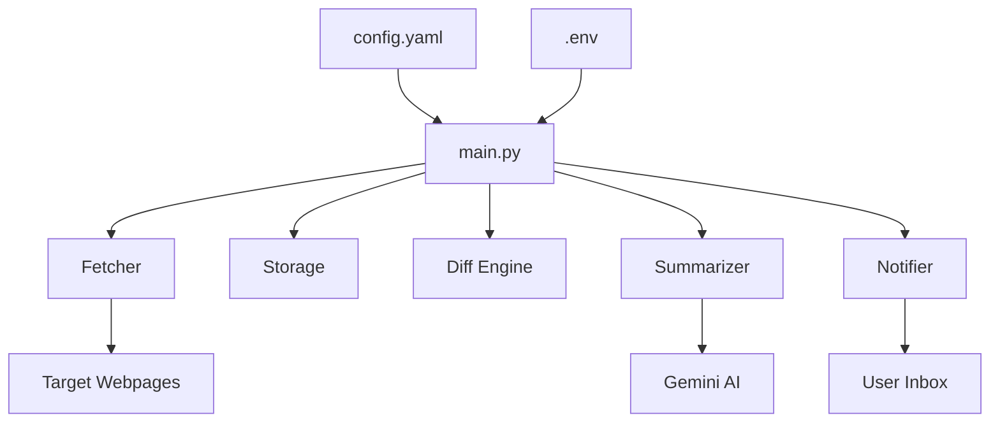

# AI Webpage Monitor

[](https://creativecommons.org/licenses/by-nc/4.0/)
[](https://www.python.org/downloads/)
[](https://playwright.dev/)
[](https://deepmind.google/technologies/gemini/)

A professional, AI-native webpage monitoring engine designed to track updates, summarize changes with high precision, and deliver actionable insights directly to your inbox. Optimized for both local use and cloud-native deployment on Google Cloud Platform.

---

## 🏗️ Architecture & System Design

The application follows a modular architecture based on a **Fetch-Extract-Diff-Summarize-Notify** pipeline. This design ensures separation of concerns, allowing for easy updates to the AI model, fetching logic, or storage backend.

### System Overview

Standard flow of the monitoring engine:

```text
[ config.yaml ]       [ .env ]
       |                 |
       v                 v
    +-----------------------+
    |       main.py         | (Orchestrator)
    +-----------+-----------+
                |
    +-----------v-----------+      +-----------------------+
    |       Fetcher         | ---> |   Target Webpages     |
    | (Playwright/Stealth)  |      | (Bypass Anti-Bot)     |
    +-----------+-----------+      +-----------------------+
                |
    +-----------v-----------+      +-----------------------+
    |     Diff Engine       | <--- |    Storage Backend    |
    | (Set-based comparison)|      | (Local JSON / GCS)    |
    +-----------+-----------+      +-----------------------+
                |
    +-----------v-----------+      +-----------------------+
    |      Summarizer       | ---> |   Google Gemini AI    |
    | (Insight Extraction)  |      |   (LMM Analysis)      |
    +-----------+-----------+      +-----------------------+
                |
    +-----------v-----------+      +-----------------------+
    |       Notifier        | ---> |    User's Inbox       |
    |  (SMTP / Gmail API)   |      | (Daily Report / MD)   |
    +-----------------------+      +-----------------------+
```

> [!NOTE]
> If your viewer supports Mermaid, you will see a dynamic version of the diagram below.



### Logical Flow
1.  **Configuration Loading**: Orchestrates the cycle based on `config.yaml` and environment variables.
2.  **Intelligent Fetching**: Launches a headless browser instance per site using **Playwright**, applying a sophisticated **Stealth Layer** to bypass automated traffic blockers (Cloudflare, etc.).
3.  **Content Extraction**: Parses the DOM using BeautifulSoup, striping noise (nav, footer, scripts) while preserving Markdown-style links for AI context.
4.  **Stateful Diffing**: Compares current content against historical data stored in the **Storage Backend**. It uses a set-based line comparison to identify unique *added* content while ignoring minor layout shifts.
5.  **AI Analysis**: Sends the "new content" to **Google Gemini**. The system uses specialized prompt engineering to:
    - Identify specific article titles and source URLs.
    - Synthesize a "So What?" focused summary.
    - Extract key strategic insights.
6.  **Reporting**: Aggregates all site updates into a single Markdown-formatted email. Supports a "No New Content" heartbeat to confirm system health.

---

## 🚀 Key Functionalities

### 🧠 AI-Powered Insights
Unlike traditional monitors that only detect change, this tool *understands* the change. Using Gemini 1.5 Flash, it filters out noise and summarizes long updates into concise, bulleted insights.

### 🕵️ Advanced Stealth & Anti-Bot
Built-in protection against modern bot-detection:
- **Playwright Stealh**: Overrides `navigator.webdriver`, mocks `chrome` objects, and mimics real-user plugins/MimeTypes.
- **Human-like Interaction**: Randomized timeouts and specific user-agent rotations.
- **State Persistence**: Saves browser state (cookies/tokens) after successfully bypassing challenges to ensure smoother subsequent runs.

### ☁️ Cloud-Native Storage
Seamlessly switch between:
- **LocalStorage**: Perfect for single-machine usage.
- **GCSStorage**: Enterprise-ready storage using Google Cloud Storage, enabling serverless execution on Cloud Run.

---

## 🛠️ Setup & Installation

### Prerequisites
- **Python 3.10+**
- **Google Cloud API Key** (for Gemini)
- **Gmail Account** (for sending reports)

### 1. Installation
```bash
git clone https://github.com/henryhyunwookim/webpage-monitor.git
cd webpage-monitor
pip install -r requirements.txt
playwright install chromium
```

### 2. Configuration
Create a `.env` file:
```bash
GOOGLE_API_KEY=your_gemini_key
SMTP_PASSWORD=your_gmail_app_password
```

Create a `config.yaml`:
```yaml
storage_file: "data/history.json" # Or "gs://bucket-name/history.json"
llm:
  model: "gemini-1.5-flash"
email:
  sender: "your-email@gmail.com"
  recipient: "target-email@gmail.com"
sites:
  - url: "https://example.com/news"
    name: "Example News"
```

---

## ☁️ Deployment (Google Cloud Run)

The repository includes a `deploy.ps1` script for one-command deployment to GCP.

### Automated Cloud Architecture
- **Cloud Run Job**: Executes the monitoring logic containerized.
- **Cloud Scheduler**: Triggers the job daily (or on your preferred schedule).
- **GCS Bucket**: Persists the monitoring history across serverless executions.

To deploy:
1. Update `$PROJECT_ID` in `deploy.ps1`.
2. Run `.\deploy.ps1` in PowerShell.

---

## 📜 License
Creative Commons Attribution-NonCommercial 4.0 International License.
See [LICENSE](LICENSE) file for details.
