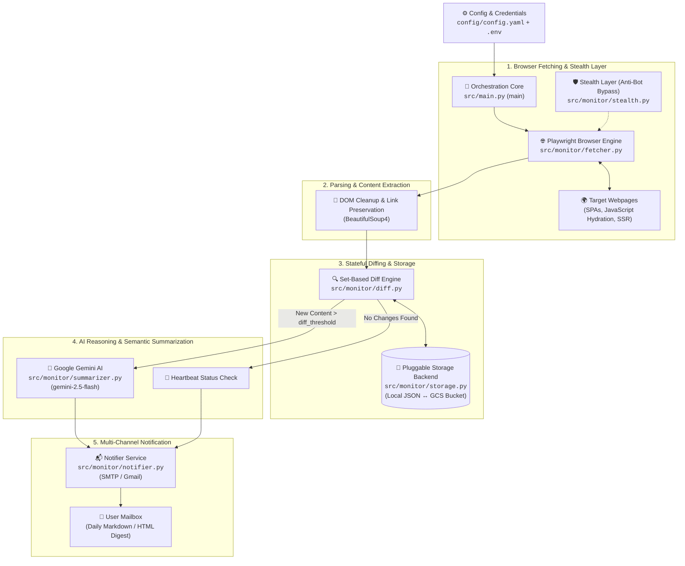

# AI Webpage Monitor

[](LICENSE)
[](https://www.python.org/downloads/)
[](https://playwright.dev/)
[](https://deepmind.google/technologies/gemini/)

A professional, AI-native webpage monitoring engine designed to track updates across complex dynamic websites, summarize changes with high signal precision using Google Gemini, and deliver actionable insights directly to your inbox. Architected for both local development and zero-downtime serverless deployment on Google Cloud Platform.


---

## 🏗️ Architecture & System Design

The application follows a decoupled **Fetch-Extract-Diff-Summarize-Notify** pipeline. This modular pattern isolates browser automation, semantic extraction, vector/set comparisons, LLM inference, and multi-channel notifications.

### System Overview & Execution Flow


```mermaid
flowchart TD
    CONFIG["⚙️ Config & Credentials<br/><code>config/config.yaml</code> + <code>.env</code>"] --> MAIN["🚀 Orchestration Core<br/><code>src/main.py</code> (main)"]
    
    subgraph INGESTION["1. Browser Fetching & Stealth Layer"]
        MAIN --> FET["🌐 Playwright Browser Engine<br/><code>src/monitor/fetcher.py</code>"]
        STEALTH["🛡️ Stealth Layer (Anti-Bot Bypass)<br/><code>src/monitor/stealth.py</code>"] -.-> FET
        FET <--> TARGET["🌍 Target Webpages<br/>(SPAs, JavaScript Hydration, SSR)"]
    end

    subgraph EXTRACTION["2. Parsing & Content Extraction"]
        FET --> PARSE["🧹 DOM Cleanup & Link Preservation<br/>(BeautifulSoup4)"]
    end

    subgraph DIFF_ENGINE["3. Stateful Diffing & Storage"]
        PARSE --> DIFF["🔍 Set-Based Diff Engine<br/><code>src/monitor/diff.py</code>"]
        DIFF <--> STORE[("💾 Pluggable Storage Backend<br/><code>src/monitor/storage.py</code><br/>(Local JSON ↔ GCS Bucket)")]
    end

    subgraph AI_SUMMARY["4. AI Reasoning & Semantic Summarization"]
        DIFF -->|New Content &gt; diff_threshold| SUM["🧠 Google Gemini AI<br/><code>src/monitor/summarizer.py</code><br/>(gemini-2.5-flash)"]
        DIFF -->|No Changes Found| HEARTBEAT["💓 Heartbeat Status Check"]
    end

    subgraph NOTIFICATION["5. Multi-Channel Notification"]
        SUM --> NOT["📬 Notifier Service<br/><code>src/monitor/notifier.py</code><br/>(SMTP / Gmail)"]
        HEARTBEAT --> NOT
        NOT --> INBOX["📩 User Mailbox<br/>(Daily Markdown / HTML Digest)"]
    end
```

### Repository Structure

```text
.
├── NotebookLM/                 # AI-generated documentation & multimedia
│   ├── AI_Webpage_Monitor.mp4  # Video overview of the project
│   └── Visual Overview.png     # Infographic of the architecture
├── config/                     # Configuration schemas & templates
│   ├── .env.example            # Environment variable template
│   └── config.example.yaml     # Site monitoring configuration template
├── deploy/                     # Cloud deployment manifests
│   ├── .gcloudignore           # Google Cloud build ignore rules
│   ├── deploy.ps1              # Automated Cloud Run & Scheduler deploy script
│   └── Dockerfile              # Container manifest (Playwright + Python)
├── scripts/                    # Utility scripts for local execution
│   └── run.bat                 # Windows execution launcher
├── src/                        # Application source code
│   ├── monitor/                # Core pipeline modules
│   │   ├── diff.py             # Stateful set-based diff algorithm
│   │   ├── fetcher.py          # Playwright browser lifecycle manager
│   │   ├── logger.py           # Centralized logging setup
│   │   ├── notifier.py         # SMTP email delivery client
│   │   ├── stealth.py          # Anti-bot bypass & browser fingerprint masking
│   │   ├── storage.py          # Dual-mode storage (Local JSON / Google Cloud Storage)
│   │   └── summarizer.py       # Google Gemini LLM summarization engine
│   └── main.py                 # Pipeline entrypoint and orchestration loop
├── .gitignore                  # Git ignore rules
├── LICENSE                     # Creative Commons License
├── README.md                   # System documentation
└── requirements.txt            # Python dependencies
```

---

## 🏛️ Technical & Architectural Decisions

- **Playwright Headless Stealth over Lightweight HTTP Requests (`requests`/`httpx`)**:
  - *Decision*: Drive a headless Chromium instance equipped with custom stealth evasions rather than issuing standard HTTP GET requests.
  - *Rationale*: Modern media and technical blogs are increasingly built as Single-Page Applications (SPAs) requiring client-side JavaScript execution. Plain HTTP requests receive blank shells or encounter Cloudflare/DataDome challenges. The stealth layer overrides `navigator.webdriver`, masks Chromium fingerprint markers, and mimics real-user plugins.
  - *Trade-off*: Higher memory footprint and slightly slower fetch cycle per site, mitigated by sequential execution and headless container recycling.

- **Set-Based Text Diffing over DOM AST Differencing**:
  - *Decision*: Normalize and compare clean line sets rather than structural HTML Document Object Model trees.
  - *Rationale*: DOM structures change constantly due to advertising banners, dynamically generated CSS classes, randomized `div` IDs, and timestamp re-renders. Set-based line diffing isolates genuine informational text changes while completely ignoring cosmetic structural shifts.
  - *Trade-off*: Content reordering without textual alterations is not flagged as a change, which aligns with the goal of tracking editorial content updates.

- **Dual-Mode Pluggable Storage (Local JSON vs. Google Cloud Storage)**:
  - *Decision*: Automatically toggle between a local filesystem file (`data/history.json`) and a Google Cloud Storage object (`gs://<bucket>/history.json`) based on the URI prefix.
  - *Rationale*: Enables seamless single-command local testing on developer workstations without GCP credentials while providing state persistence across stateless, ephemeral Google Cloud Run container executions.

---

## 🧠 Generalizability & Intelligence

This monitor is **platform-agnostic** and tracks updates across any public web property:

### 1. Browser-Based Extraction (Playwright)
- **Single Page Applications (SPAs)**: Captures dynamically hydrated DOMs (React, Vue, Angular, Svelte).
- **Anti-Bot Stealth**: Overrides `navigator.webdriver`, mocks `window.chrome`, rotates user-agents, and persists session cookies.

### 2. LLM-Powered Semantic Analysis
- Strips navigation bars, sidebars, cookie banners, and footers while preserving markdown link anchors.
- Passes extracted text to **Google Gemini** with structured prompt engineering to:
  - Extract exact article headlines, publication contexts, and destination URLs.
  - Synthesize a "So What?" executive summary tailored to strategic impact.
  - Group findings into actionable bulleted insights.

### 3. Stateful Set-Based Diffing
- Compares normalized lines against prior runs stored in `storage_file`.
- Evaluates `diff_threshold` (minimum character/token count) to prevent trivial false-positive runs caused by copyright year updates or minor typo fixes.

---

## ⚙️ Configuration

Copy the example configuration files in [config/](config/):

```bash
# Set up active configuration
cp config/config.example.yaml config/config.yaml
cp config/.env.example config/.env
```

### 1. `config/config.yaml` Schema

```yaml
# LLM Configuration
llm:
  provider: "gemini"
  model: "gemini-2.5-flash"

# Email Configuration
email:
  sender: "your-sending-email@gmail.com"
  recipient: "where-to-send-reports@example.com"
  smtp_server: "smtp.gmail.com"
  smtp_port: 587

# Target Websites Matrix
sites:
  - url: "https://example.com/news/"
    name: "Example News"
  - url: "https://techblog.com/"
    name: "Tech Blog"
    type: "video" # Optional: specialized parser hint

# System & Storage
storage_file: "data/history.json" # Local path or gs://your-bucket-name/history.json
diff_threshold: 10                # Minimum added characters before triggering AI summary
```

### 2. Environment Variables (`.env`)

| Variable | Description | Required | Example |
| :--- | :--- | :--- | :--- |
| `GOOGLE_API_KEY` | Gemini API key from Google AI Studio | **Yes** | `AIzaSy...` |
| `SMTP_PASSWORD` | Gmail App Password (16 characters) | **Yes** | `abcd efgh ijkl mnop` |

---

## 🛠️ Setup & Installation

### Prerequisites
- **Python 3.10+**
- **Google Cloud API Key** (Gemini API access)
- **Gmail Account** with 2-Step Verification and an generated App Password

### 1. Local Setup

```bash
# Clone the repository
git clone https://github.com/henryhyunwookim/webpage-monitor.git
cd webpage-monitor

# Create and activate virtual environment
python -m venv .venv
# Windows:
.venv\Scripts\activate
# macOS/Linux:
source .venv/bin/activate

# Install dependencies
pip install -r requirements.txt
playwright install chromium
```

### 2. Execution

```bash
# Run locally via script launcher (Windows)
.\scripts\run.bat

# Or run directly via Python orchestrator
python src/main.py --config config/config.yaml
```

### 3. Docker Execution

```bash
docker build -t webpage-monitor -f deploy/Dockerfile .
docker run --env-file config/.env webpage-monitor
```

---

## ☁️ Deployment (Google Cloud Run & Cloud Scheduler)

The repository provides an automated PowerShell deployment script in [deploy/deploy.ps1](deploy/deploy.ps1) targeting Google Cloud Platform in the Tokyo region (`asia-northeast1`).

### Serverless Cloud Architecture
- **Cloud Run Job**: Executes containerized Chromium in `asia-northeast1`.
- **Cloud Scheduler**: Triggers daily execution (e.g., 00:00 JST/KST) via Cloud Run Invoker IAM.
- **Google Cloud Storage**: Maintains state history across job instances at `gs://<project-id>-monitor-data/history.json`.

```powershell
# Deploy to Google Cloud Platform
powershell -File deploy/deploy.ps1 -ProjectId "YOUR_GCP_PROJECT_ID" -Region "asia-northeast1"
```

> [!IMPORTANT]
> Ensure that `GOOGLE_API_KEY` and `SMTP_PASSWORD` are configured in the Cloud Run Job environment variables or linked to GCP Secret Manager after deployment.

---

## 📜 License

This project is licensed under the [Creative Commons Attribution-NonCommercial 4.0 International License](LICENSE).
